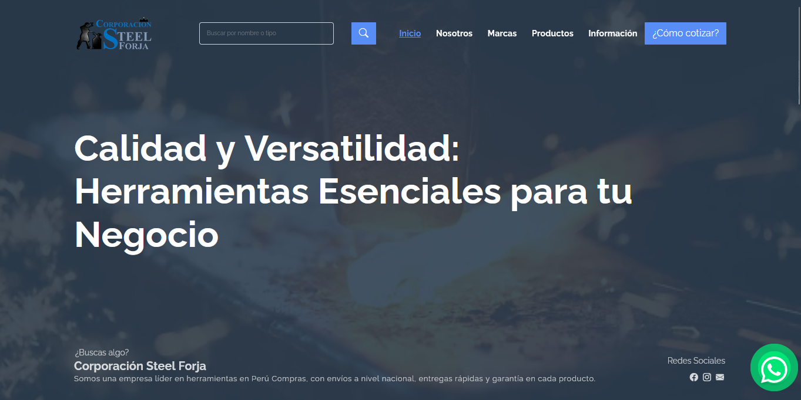

# ¡Hola! 

## Soy Jhon Mendoza

Estudiante de ingeniería de Sistemas graduado de la Universidad Tecnológica del Perú (UTP). Actualmente profundizo mis conocimientos en Estructuras de Datos y Algoritmos, mientras implemento los fundamentos de la ingeniería informática y desarrollo web con React. Me apasiona explorar y aprender nuevas tecnologías.

 <b><i align="center">"La vida está llena de decisiones... ¡elige sabiamente!"</i></b> 

##  Sobre mí

- 🔭 Actualmente trabajo en desarrollo web utilizando HTML5, CSS3 y JavaScript
- 🌱 Continuamente aprendiendo sobre tecnologías frontend y backend
- 🤝 Busco colaborar en proyectos innovadores que mejoren nuestra eficiencia diaria
- 💬 Puedes preguntarme sobre Java, HTML, CSS, React, C++, PHP, Python y más
- 📫 Contáctame en [jhomti2002@gmail.com](mailto:jhomti2002@gmail.com)
- 💼 Conéctate conmigo en [LinkedIn](https://www.linkedin.com/in/jhomt/)
- 📚 En mi tiempo libre, me gusta leer sobre finanzas y negocios

<!-- Información de contacto -->

 
 Contacto

  <samp>
    <h2 align="center">Puedes encontrarme en:</h2>
    

      
      
      
    

  </samp>

<!-- Tecnologías y herramientas -->

 
 Tecnologías y Herramientas

 

 <samp>

  
  
  
  
  
  
  
  
  
  
  
  
  
  

 </samp>
 

 

<!-- Estadísticas de GitHub -->

 Estadísticas de GitHub

  

   &nbsp;<i><b>Actividad en Git</b></i>

  

   
  

  

   
  

  

   
  

  

   
  

<h3 align="center">Resumen de Actividad</h3>
  

   
  

 

 

<!-- Proyectos Destacados -->

 Proyectos Destacados

  <samp>
    <h2 align="center">Mis mejores trabajos</h2>
      

        
        
      

  </samp>

<!-- Certificaciones -->

 Certificaciones y Educación

  <samp>
    <h2 align="center">Formación y Logros</h2>
    

      🎓 Ingeniería de Sistemas - Universidad Tecnológica del Perú (UTP) 
      📜 Certificación en Desarrollo Web - FreeCodeCamp 
      📜 Certificación en Java - Oracle 
      📜 Certificación en Scrum - Scrum Alliance
    

  </samp>

  

